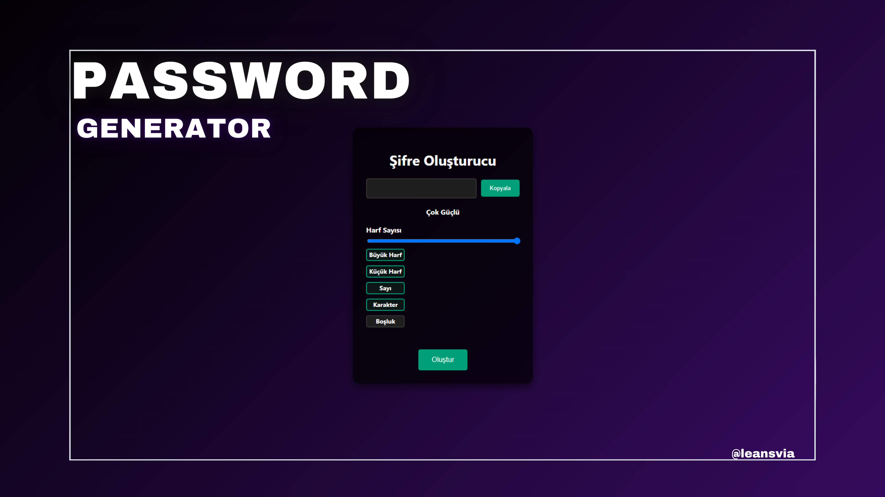

# Şifre Oluşturucu

Bu proje, kullanıcıların belirli kriterlere göre güçlü şifreler oluşturmasına olanak tanıyan bir şifre oluşturucu uygulamasıdır.

## Özellikler

- Harf, sayı ve özel karakterler içeren güçlü şifreler oluşturma.
- Şifrenin uzunluğunu ayarlama.
- Kopyalama ve şifre gücünü gösterme.
- Eşşsiz şifreler oluşturarak guvenliginizi sağlayın.

## Kurulum

1. Depoyu klonlayın:
   ```bash
   git clone https://github.com/leansvia/password-generator.git


